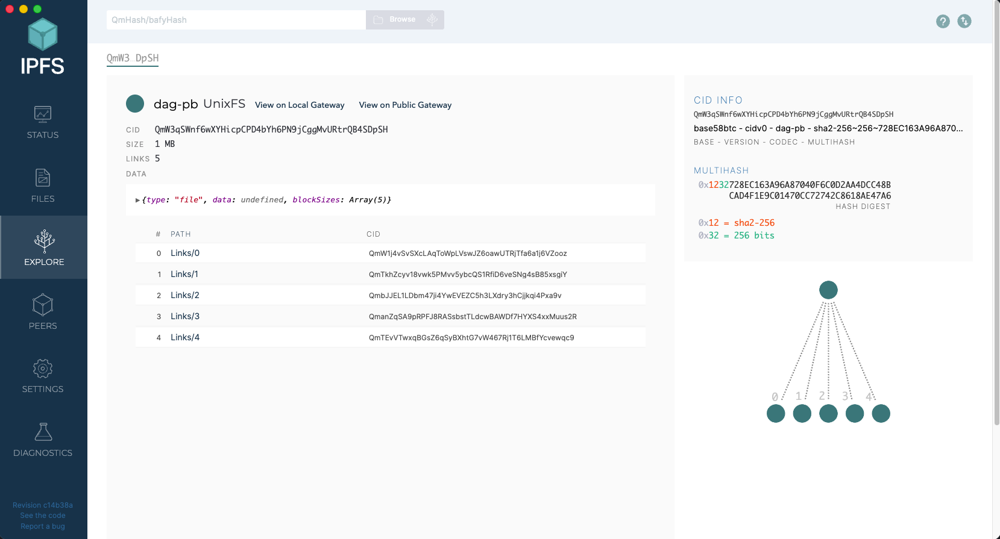

id: html
summary: 프로젝트 요구사항에 알맞게 Smart Contract를 개발한다.
categories: Solidity
status: Published
feedback email: sinphi03@gmail.com
tags: Solidity, Blockchain, Smart Contracts
authors: Jiseop Shin
duration: 110

# Week 3: Smart Contract 개발 및 보안 사항 수정

## 세션 소개

Duration: 5

이번 세션에서는 Committee와 관련된Smart Contract를 작성하고 이 과정에서 발생하는 온체인&오프체인 흐름을 이해합니다. 또한, Smart Contract 보안 취약점과 대응 전략을 학습을 진행합니다.

### 목차

#### 1. IPFS 구조 및 동작 원리

IPFS의 핵심 컴포넌트를 살펴보고 동작 방식을 익힙니다. 또한, 파일 추가·조회·핀(pinning) 등의 동작 흐름과 주요 사용법을 실습합니다.

#### 2. Shamir's Secret Sharing(SSS) Algorithm

샤미르 비밀 공유의 수학적 원리와 구현 방법을 다루고, Committee 환경에서 비밀 분할·복원 절차와 안전성 고려사항을 확인합니다.

#### 3. Committee Manager 구현

Shard 제출, 위원회 관리 등 `CommitteeManager`에 필요한 기능을 설계하고 Smart Contract를 구현합니다.

#### 4. 취약점 탐색 및 수정

기존 컨트랙트에서 발생할 수 있는 온체인/오프체인 취약점을 찾아 수정합니다.

## IPFS 구조 및 동작 원리

Duration: 14

[IPFS(InterPlanetary File System)](https://ipfs.tech/)는 콘텐츠 주소화(content addressing), 분산 P2P 네트워크(libp2p), DHT 기반 라우팅(BitSwap), IPLD(Merkle-DAG) 데이터 모델로 이루어진 분산 파일 시스템입니다. 핵심은 파일의 위치가 아니라 내용(CID) 으로 식별하고, 여러 피어가 데이터를 교환한다는 점입니다.

### IPFS 구조 및 동작 원리

#### 콘텐츠 주소화 & CID(Content Identifier)

IPFS는 파일이나 디렉터리를 저장할 때 먼저 데이터를 **여러 블록으로** 분할하고, 각 블록을 해시하여 **고유한 식별자(CID)를** 만듭니다. 해시를 통해 만들어졌으므로 같은 내용은 언제 어디서 저장되든 동일한 CID를 갖습니다. CID는 크기와 무관하게 짧고, 위치가 아닌 내용을 가리키는 주소입니다.

#### IPLD(Merkle-DAG) & UnixFS

IPFS에서 Merkle DAG를 통해 내용 그 자체로 구분하고, 여러 조각(블록)들이 서로 연결된 형태로 저장되도록 만들고, UnixFS는 이 위에 파일/디렉터리 구조를 얹어 실질적인 파일 저장, 탐색이 가능하도록 만든 포맷입니다. 이 두 가지가 결합됨으로써 IPFS는 파일 단위 저장의 유연성과 블록 단위 저장의 효율성을 동시에 확보할 수 있습니다.

데이터를 분할한 블록들 사이에 Merkle DAG(Directed Acyclic Graph) 구조를 구성하는데, 각 노드는 자신의 데이터(payload)와 자식 블록의 CID 리스트(links)를 포함하며, 이 두 정보를 해시한 값이 그 노드의 식별자가 됩니다. 이러한 방식 덕분에 중복되는 데이터 블록은 여러 위치에 저장되더라도 해시가 동일하기 때문에 자연스럽게 **중복 제거(deduplication)가** 이루어집니다.


IPFS 내 파일·디렉터리 저장을 위해 설계된 계층이 UnixFS입니다. UnixFS는 이 Merkle DAG 위에 **파일 시스템처럼 보이도록** 청크(chunk) 분할, 링크 구조, 디렉터리 계층 등 메타데이터를 더해 구현된 데이터 포맷입니다.

정리하자면, 크기가 큰 파일은 여러 블록으로 나뉘고 이 블록들은 Merkle DAG의 자식 노드로 연결되어 루트 노드가 전체 파일을 대표하게 됩니다. 이렇게 구성되면 파일의 각 부분을 개별적으로 검증하고, 블록 중 일부만 변경되어도 전체 CID가 변경되므로 변경 감지 및 무결성 관리가 수월해집니다.

#### Bitswap

노드들은 **원하는 블록의 CID 리스트**를 브로드캐스트하고, 연결된 피어로부터 직접 블록을 받습니다. 다수의 피어와 동시 교환이 가능합니다. 교환 전략은 기본적으로 tit-for-tat 정책을 사용합니다.

IPFS의 노드들은 자신이 필요로 하는 데이터 블록의 CID(Content Identifier) 목록(want-list)를 주변 피어들에게 브로드캐스트합니다. 이 목록을 받은 피어들은 자신이 해당 블록을 보유하고 있을 경우 이를 제공하며, 요청한 노드는 동시에 여러 피어로부터 데이터를 전송받을 수 있습니다. 이러한 병렬 교환 구조 덕분에 전송 속도와 네트워크 활용 효율이 크게 향상됩니다. **BitTorrent**와 유사하게 **tit-for-tat** 전략을 사용하여, 네트워크 참여자들이 공정하게 자원을 교환하도록 유도하고, 결과적으로 IPFS 전체의 데이터 가용성과 신뢰성을 높여 줍니다.

#### DHT

DHT(Distributed Hash Table)는 분산 네트워크 환경에서 데이터를 효율적으로 저장하고 검색하기 위한 해시 테이블 구조입니다. 네트워크 내의 특정 자원(resource)을 저장할 때, 해시 함수를 통해 자원의 정보를 암호화하여 고유한 키(key) 를 생성하고, 이 키를 담당할 노드를 일정한 규칙에 따라 선택하여 데이터를 분산 저장합니다. 즉, 각 노드는 전체 키 공간의 일부를 담당하며, 특정 키를 기반으로 **어느 노드가 해당 데이터를 갖고 있는지**를 계산할 수 있습니다.
이때 탐색 효율을 높이기 위해 각 노드는 다른 피어의 정보를 일정 부분만 알고 있으며, 대표적으로 Kademlia와 같은 알고리즘을 사용하여 O(log N) 단계 안에 원하는 데이터를 찾을 수 있습니다.
IPFS에서는 Kademlia 기반 DHT를 사용하고 Content Routing을 위한 지도 역할이고, 실제 데이터 전송은 Bitswap으로 이루어집니다.

IPFS에서 사용하는 DHT에 대해서는 [공식 문서](https://docs.ipfs.tech/concepts/dht/#kademlia)에 잘 정리돼 있습니다.

### IPFS 사용하기

#### 실행과정

IPFS 실행하는 과정은 다음과 같습니다.

1. IPFS 노드 설치: 먼저 사용할 컴퓨터 또는 장치에 IPFS 노드를 설치해야 합니다. CLI 환경이라면 [Kubo](https://docs.ipfs.tech/install/command-line/)를, Desktop 환경에서 사용하고 싶으면 [Desktop App](https://docs.ipfs.tech/install/ipfs-desktop)을 OS에 맞게 설치합니다.

2. IPFS 노드 실행: `ipfs init`으로 로컬 리포를 만들고, `ipfs daemon`으로 노드를 실행해 네트워크에 참여합니다. 브라우저용 대시보드와 로컬 게이트웨이도 확인할 수 있습니다.

3. 파일 추가: 파일을 IPFS에 추가하기 위해 `ipfs add` 명령을 사용합니다. 이 명령을 사용하면 지정된 파일을 IPFS 네트워크에 추가하고 해당 파일의 해시 값을 반환합니다. 예를 들어, ipfs add example.txt 명령을 사용하여 “example.txt”라는 파일을 추가할 수 있습니다.

4. 해시 값 확인: 출력된 CID가 곧 파일의 식별자입니다. 같은 내용이면 CID가 동일합니다. `ipfs cat <CID>` 으로 내용 조회가 가능합니다.

5. 파일 공유: CID만 알면 전 세계 어디서든 접속 가능하며, 게이트웨이를 통해 `https://ipfs.io/ipfs/<CID>` 같은 URL로도 접근할 수 있습니다. 영구 보존을 원하면 pin 하거나 핀닝 서비스(web3.storage 등)를 사용합니다.

#### IPFS Desktop

[IPFS Desktop](https://docs.ipfs.tech/install/ipfs-desktop)을 설치하면 다음과 같은 기본 대시보드를 볼 수 있습니다. 아래 사진처럼 로컬 Kubo 노드의 상태(Status), 피어 연결 수, 데이터 사용량, 게이트웨이 주소 등을 한눈에 확인할 수 있습니다.


Settings 화면의 맨 하단에는 `Kubo Config` 항목이 있습니다.
이는 로컬 IPFS 노드의 설정 파일(`~/.ipfs/config`)을 GUI 형태로 편집할 수 있는 영역입니다.


여기에서 Bootstrap이 `auto`로 되어 있으면 Kubo가 내장된 `공식 부트스트랩 피어 목록을` 자동으로 사용합니다. 이 피어들은 전 세계적으로 배포된 IPFS의 초기 진입 노드로, 노드가 처음 실행될 때 DHT 네트워크에 연결되도록 도와줍니다. 직접 네트워크(프라이빗 IPFS 클러스터 등)를 운영할 때는 여기에 커스텀 피어 리스트를 넣어주면 됩니다.

```text
"Bootstrap": [
  "/ip4/203.0.113.12/tcp/4001/p2p/QmExamplePeer"
]
```

이렇게 하면 Kubo가 공용 네트워크 대신 지정된 피어를 우선 연결 대상으로 사용합니다. 즉, 특정 조직·프로젝트 내에서만 콘텐츠를 공유하는 **폐쇄형 IPFS 네트워크를** 구성할 수 있습니다.

IPFS Desktop의 `Files` 탭에서는 로컬에서 업로드한 파일을 IPFS 네트워크에 추가하고 관리할 수 있습니다. 파일을 업로드하면 내부적으로 다음 과정이 일어납니다:

- 파일이 여러 블록(block)으로 분할합니다.
- 각 블록에 대해 CID가 계산됩니다.
- 블록들이 Merkle DAG 형태로 연결되어 파일 전체를 표현합니다.
- 루트 노드의 CID가 파일의 고유 주소가 됩니다.

이 구조를 시각적으로 보고 싶다면, 파일을 선택한 후 `Inspect` 버튼을 클릭하면 됩니다.



#### Kubo

Kubo는 Go로 작성된 IPFS의 가장 널리 쓰이는 구현체이며, CLI/RPC API/게이트웨이를 제공합니다. 과거 이름은 go-ipfs입니다.

1. 저장소 초기화

ipfsKubo는 모든 설정과 내부 데이터를 저장소라는 디렉터리에 저장합니다. Kubo를 처음 사용하기 전에 저장소를 초기화해야 합니다.

```bash
ipfs init
```

다음과 같은 형태로 출력되면 됩니다.


2. 노드를 온라인으로 전환

노드를 온라인으로 전환하고 IPFS 네트워크와 상호 작용합니다. 다른 터미널 창을 열어 IPFS 데몬을 시작합니다.

```bash
ipfs daemon
```

원래 터미널 창으로 돌아가 ipfs swarm peers피어의 IPFS 주소를 확인합니다.

```bash
ipfs swarm peers
```

3. 파일 가져오기

다음의 명령어를 입력하여 우주선 발사 사진을 가져옵니다. `QmSgvgwxZGaBLqkGyWemEDqikCqU52XxsYLKtdy3vGZ8uq`는 [공식 문서](https://docs.ipfs.tech/how-to/command-line-quick-start/#take-your-node-online)에서 소개된 CID입니다.

```bash
 ipfs cat /ipfs/QmSgvgwxZGaBLqkGyWemEDqikCqU52XxsYLKtdy3vGZ8uq > ~/Desktop/spaceship-launch.jpg
```

4. 파일 업로드

원하는 파일을 다음의 명령어를 통해 업로드합니다.

```bash
ipfs add spaceship-launch.jpg
```

다음과 같이 추가됩니다.


#### web3.storage

web3.storage는 IPFS이나 Filecoin을 쉽게 사용할 수 있는 서비스입니다.
업로드 시 자동으로 CAR(내용 주소 가능 아카이브)로 패킹하고, IPFS에 배포하며 Filecoin 백업을 제공합니다. JS/Go/HTTP API를 지원합니다. 우리는 자체 노드를 운영하지 않고 암호화된 소스코드(데이터)를 보관하기 위해 사용할 예정입니다.

HTTP/Go 클라이언트 예시와 상세 API는 [레퍼런스 문서](https://staging.web3.storage/docs/reference/http-api/)에서 확인할 수 있습니다.

#### Helia

[Helia](https://helia.io/)는 브라우저/Node.js 환경을 위한 모던 JS IPFS 구현체입니다.
모듈화가 잘 되어 있고, `@helia/*` 패키지와 `js-kubo-rpc-client` 등과 함께 사용할 수 있습니다. 공식 JS 레퍼런스는 Helia와 연동 도구들을 소개합니다.

#### Pinata

[Pinata](https://pinata.cloud/)는 IPFS 상에서 파일을 손쉽게 업로드하고 영구적으로 **고정(pin)** 시킬 수 있도록 도와주는 클라우드 기반의 IPFS 핀 서비스입니다. IPFS는 탈중앙화된 파일 저장 네트워크이기 때문에, 기본적으로 특정 노드가 파일을 보관하지 않으면 데이터가 사라질 수 있습니다. Pinata는 사용자가 업로드한 콘텐츠를 자사 노드에 고정해 두어 언제나 접근 가능하도록 유지해 주는 역할을 합니다.

현재 웹 데모는 로컬 환경이거나 Pinata를 사용 불가능한 환경에서는 Helia를 이용해 브라우저에 파일을 저장하고, Pinata를 사용 가능한 환경에서 Helia로 업로드된 파일을 Pinata 스토리지에 다시 한 번 저장합니다. 이를 사용하려면 회원가입 후 [API Key](https://app.pinata.cloud/developers/api-keys)를 받아주세요.

## Shamir's Secret Sharing(SSS) Algorithm

Duration: 20

샤미르 비밀 공유의 수학적 원리와 구현 방법을 다루고, Committee 환경에서 비밀 분할·복원 절차와 안전성 고려사항을 확인합니다.

## Committee Manager 구현

Duration: 30

Shard 제출, 위원회 관리 등 `CommitteeManager`에 필요한 기능을 설계하고 Smart Contract를 구현합니다.

## 취약점 탐색 및 수정

Duration: 49

## 축하합니다

Duration: 1

축하합니다! 성공적으로 License 관련 컨트랙트를 작성하고 IPFS에 대해 익혔습니다. 다음 시간에는 위원회 관련 컨트랙트 개발과 기존 컨트랙트에서 보안할 점을 확인하도록 하겠습니다.

### 도움이 될 만한 자료

1. [Lit Protocol](https://www.litprotocol.com/): Lit Protocol은 key와 secrets을 관리하기 위한 탈중앙화 네트워크 프로토콜입니다. 본 프로젝트는 이러한 Lit Protocol에서 영감을 받아, DKG(Distributed Key Generation) 개념을 기반으로 이를 솔리디티로 구현하였습니다. Lit Protocol에 대한 보다 자세한 내용은 [공식 백서](https://github.com/LIT-Protocol/whitepaper)를 참고하시기 바랍니다.
2. [IPFS Concepts](https://docs.ipfs.tech/concepts/): [IPFS](https://github.com/ipfs)는 Web3 생태계에서는 중대형 오픈소스 프로젝트입니다. 또한, 이에 대한 구현 원리를 이해하기 위해서 Merkle DAG, UnixFS, DHT, Pub/Sub 모델(Gossip), BitSwap 등 Computer Sicence 관련 배경지식을 많이 요구합니다.
3. [proto school](https://proto.school/tutorials): IPFS나 filecoin과 같은 분산형 웹 스토리지 시스템에 관한 기술 튜토리얼입니다.

### 참고 자료

1. [openzeppelin의 contract관련 개발 문서](https://docs.openzeppelin.com/contracts)
2. [EIP-20: ERC-20(Token Standard)](https://eips.ethereum.org/EIPS/eip-20)
3. [EIP-165: ERC-165(Standard Interface Detection)](https://eips.ethereum.org/EIPS/eip-165)
4. [EIP-721: ERC-721(Non-Fungible Token Standard)](https://eips.ethereum.org/EIPS/eip-721)
5. [EIP-1155: ERC-1155(Multi Token Standa)](https://eips.ethereum.org/EIPS/eip-1155)
